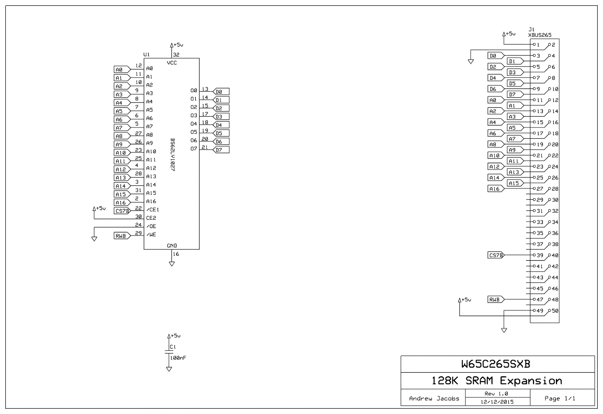

# BCPL for the WDC W65C265SXB
This project builds on the work of JeeLabs ([https://jeelabs.org/2017/11/tfoc---a-compiler-in-256-loc/](https://jeelabs.org/2017/11/tfoc---a-compiler-in-256-loc/)) to create fully self hosted BCPL programming environment on a WDC W65C265SXB single board computer that has been pimped out with at least 128K of additional RAM and a serially connected CH376S USB interface module.

## Hardware

### Memory Expansion
Adding some additional memory to a W65C265SXB is very easy. The XBUS connector in the side of the SXB board provides access to power, the address bus, the data bus and some control signals.

You can connect a 128K SRAM chip directly to this bus as shown in the following diagram.

Note that the chip is wired with the CE2 chip select permanently high and the /OE output enable permanently low. The processors read/write signal (RWB) is connected to the /WE output enable and will override /OE when asserted low. The /CS7 signal generated by the W65C265 is used to control the active low chip select and enable the chip at the write time.

For my development I use a 1MB RAM expansion board that decodes the signals a little better but BCPL will work with this minimal configuration. 

### USB Interface

The CH376S module acts as an interface between a simple microprocessor or micro-controller and FAT based filing system on a USB disk drive or SD card. They are cheap to buy; typically only ~£2.50 from a Chinese eBay seller.

CH376S modules support three communications interfaces: an 8-bit parallel bus with read/write signals; a four wire SPI bus and two wire asynchronous serial. Not all break out boards provide the pins for SPI.

As the W65C265 has four built in UARTs serial communication is the easiest option. 

## Bootstrapping BCPL

